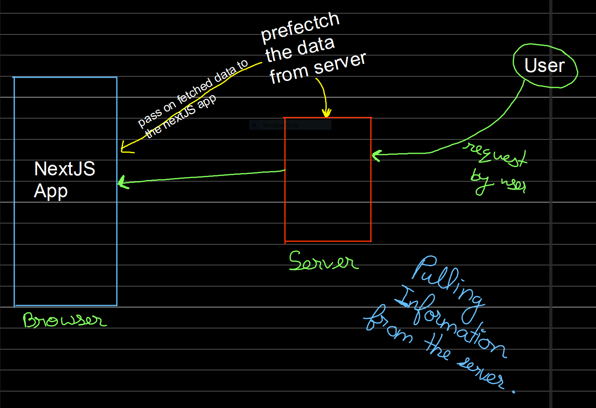

#  Airbnb using REACT.JS ( with Next.js, Tailwind CSS, Calendar Picker, Mapbox)

Technologies Used:

1. React.js
2. Next.js (Framework for React.js)
3. Tailwind CSS
4. Vercel (Deployment)
5. mapbox API

1. Choosing NextJS comes with 3 major advantages:
    
    1. Build powerful hybrid apps! (Sever Side Rendering)
    2. Incredibly powerful and easy to pickup
    3. Rapid feature development and awesome developer experience 

2. Why a developer would use NextJS?
    
    1. It has a built-in router.
    2. There is a built-in API.
    3. Built-in Image component and automatic image optimization.
    4. Fast refresh provides an amazing developer experience.
    5. Hybrid of SSR and SSG.
    6. Incremental Static Generation (Amazing for blogs).
    7. Typescript support and zero config.

3. How will NextJs improve your online business?

4. Why use Tailwind CSS over "Normal CSS"?

    1. Making styling process much faster.
    2. Provides more convenience using built-in classes.
    3. It has a highly customizable config file.
    4. Responsive breakpoints for different screen sizes.
    5. Tailwind CSS plugins are a breeze to install and use.

5. How Pull some information from the server - API Endpoints?
        
    - Server Side Rendering
    - Static Site Rendering

6. Rendering in NextJS:

7. Building the calendar on to the header component:

    - react-date-range:
        
        - https://www.npmjs.com/package/react-date-range

8. Server Side Rendering in next.js:

    - Server Side Rendering is basically preparing the information berfore it reaches the user's browser.

    - In next.js, there is a middle server which can basically process request so now when the user comes to the website page, i can use the information that we get at url or at some other stuff, to build the page beforehand get all the inoformation and then deliever the entire page to the user wihout the user having to wait for the information to load which would have spoiled the user's experience.
